# Instalación de OpenBSD sobre Vmware Workstation con Pendrive físico

## Descripción

El objetivo de está guía es armar un pendrive con el contenido necesario para instalar OpenBSD e instalar el sistema operativo sobre Vmware Workstation.

Esta guía es totalmente válida para realizar la instalación OpenBSD sobre Hardware físico, solo se debe saltear las partes donde se crea y configura la máquina virtual para que inicie desde el pendrive.

Guía probada sobre la versión 15 de Vmware Workstation y la versión 6.5 de OpenBSD.

## Armado del pendrive

A fin de facilitar la explicación de la guía, daremos por entendido que el sistema operativo desde donde se armará el pendrive es Ubuntu 18.04.

Comenzamos armando un directorio temporal para almacenar las descargas generadas durante este tutorial, en nuestro caso utilizaremos el directorio "/tmp/bsdar"

Creamos el directorio temporal e ingresamos en él. Los comandos serían:
```BASH
mkdir /tmp/bsdar
cd /tmp/bsdar
```
Descargamos la imagen desde el CDN oficial de OpenBSD.
```BASH
wget https://cdn.openbsd.org/pub/OpenBSD/6.5/amd64/install65.fs
```

Procedemos a descargar el Frimware adicional con:

```BASH
wget --recursive --no-parent http://firmware.openbsd.org/firmware/6.5
````

Ahora insertamos el pendrive y validamos con el comando dmesg que designación recibió nuestro pendrive.

En nuestro caso, vemos que el asignó /dev/sdb:


Procedemos a copiar el contenido de la imagen al pendrive con el comando:
```BASH
sudo dd if=install65.fs of=/dev/sdb bs=4M status=progress
```


Con estos pasos ya tenemos listo el pendrive para realizar una instalación base. Para finalizar con la preparación, incorporaremos el frimware no libre.

Comenzamos creando una nueva partición con fdisk y dandole formato:

```BASH
echo -e "n\np\n2\n\n+500M\nt\n2\nb\nw\n" | sudo fdisk /dev/sdb
sudo mkfs.msdos /dev/sdb2
```

Montamos la nueva unidad, copiamos el Frimware y luego desmontamos la unidad con:
```BASH
sudo mount /dev/sdb2 /mnt
sudo cp -r firmware.openbsd.org/firmware /mnt/
sudo umount /mnt
```

Ya con estos pasos ya tenemos todo lo necesario para comenzar a instalar OpenBSD.

## Creación de la máquina virtual

Comenzamos creando una nueva máquina virtual, para eso nos dirigimos al menú 
"File" -> "New Virtual Machine . . ."


Nos presentará la ventana de bienvenida, avanzamos y nos preguntará desde donde queremos instalar el sistema operativo.


En nuestro caso elegimos "I will install the operating system later" y avanzamos a la sección "Select Guest Operating System".


Seleccionamos "Other" y "FreeBSD 11 64-bit" y avanzamos a la siguiente página "Name the Virtual Machine"

Donde indica "Virtual machine name" introducimos el nombre que le daremos a la máquina virtual. En la sección "Location" debemos escribir la ruta donde se almacenar los datos de la VM o podemos dejarlo como viene por defecto.

En nuestro caso optamos por dejarlo así:


Luego avanzamos a la siguiente página con "Next". Nos preguntará por la cantidad de disco que le vamos a destinar a la VM. En nuestro caso le daremos 20 GB pero pueden asignarle los que crean convenientes.


Avanzamos a la siguiente página en la cual nos mostrará, en formato lista, con las opciones elegidas.


## Presentación del pendrive en la máquina virtual

Nos vamos a las configuraciones de la nueva máquina virtual.

(Seleccionamos la Vm -> Click derecho -> "Settings")


Agregamos un nuevo Hardware y seleccionamos "Hard Disk"

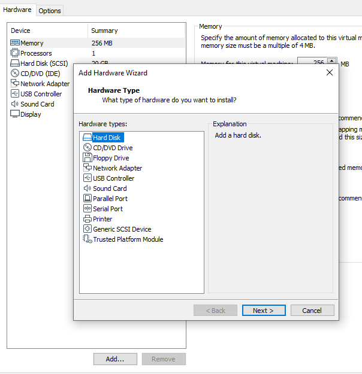

Avanzamos a la siguiente página.

Dejamos seleccionada la opción "SCSI" y avanzando a la siguiente página.

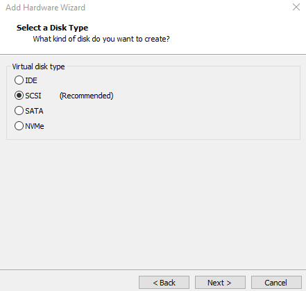

Seleccionamos la opción "Use a physical disk (for advanced users)"

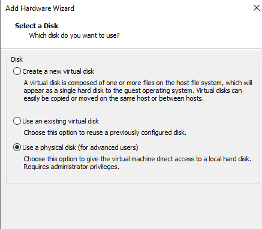

Avanzamos y seleccionamos el "Device" que corresponda a nuestro pendrive, en nuestro caso es "PhysicalDrive1".

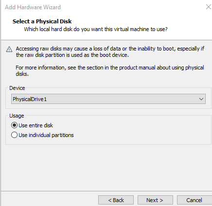

En la siguiente página nos solicitará donde guardar el archivo con la información del contenido del nuevo dispositivo. Recomendamos dejar el contenido como se presenta por defecto.

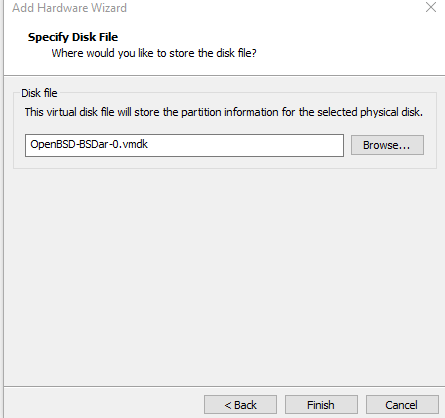

Damos en Finalizar para volver a la sección de configuraciones, os movemos a la solapa "Options" y luego seleccionamos "Advanced".

En la sección de "Firmware type" seleccionamos "UEFI"

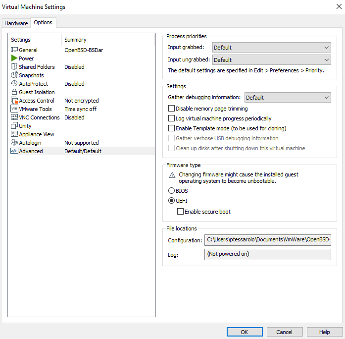


Ya con esto ya tenemos la maquina lista para instalar OpenBSD desde nuestro pendrive.

## Instalación de OpenBSD sobre VMware.

Para inicial la VM desde el Pendrive debemos seleccionar la VM e ir a 
"Menu" -> "VM" -> "Power" -> "Power On to Firmware"

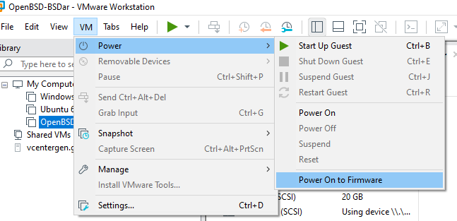

Apenas iniciamos veremos el menú del BIOS. En Este menú nos mostrará los posibles medios con los que se puede iniciar.

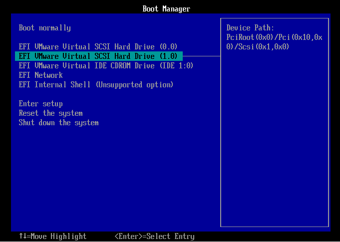

Como agregamos el pendrive como un segundo disco físico seleccionamos "EFI VMware Virtual SCSI Hard Drive (1.0)" y seleccionamos la opción oprimiendo "Enter".

Comenzaremos a ver las validaciones previas al inicio del instalador de OpenBSD. Segundos después se nos presentarán las opciones básica del instalador de OpenBSD.

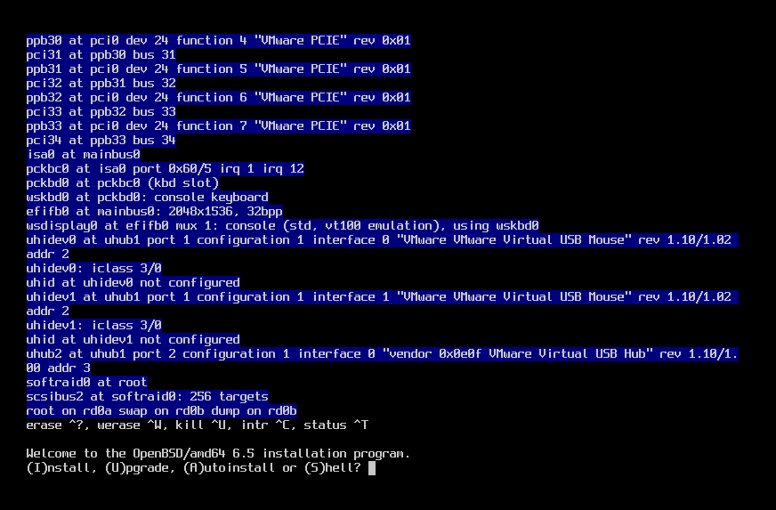

Comenzamos oprimiendo la letra "i" ya que nuestro objetivo es instalar el sistema.

El instalador nos pregunta cúal es la distribución del nuestro teclado.  Si sabemos la distribución podemos escribirla y dar "Enter" para seguir. Si no tenemos claro cúal elegir solo oprimimos "Enter" para dejar el que viene por defecto.

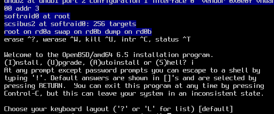

La siguiente pregunta es  "System hostname?". Debemos escribir el nombre que va a tener nuestro equipo.


A continuación, son indica que encontró varias interfaces de redes y si queremos configurar alguna. En nuestro caso vamos a utilizar la opción que nos indica "em0".

Luego oprimimos "Enter" para que intente conectarse a través de DHCP.

Una vez configurado IPv4 con DHCP el instalador nos preguntará si queremos también configurar IPv6. En nuestro caso damos "Enter" para no configurar IPv6.

Finalmente nos pregunta si queremos configurar otra interfaz. Si no queremos configurar otra interfaz, como en nuestro caso, oprimimos "Enter"

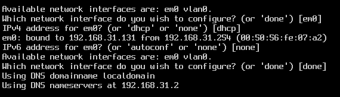

El siguiente nos pide la contraseña para el usuario "root". la ingresamos y damos "Enter". Nos solicita que la ingresemos otra vez para validar que esté bien, luego escribirla damos "Enter" para avanzar.

Nos preguntará si queremos que el servicio de SSH se inicie por defecto. En nuestro caso le decimos que no y damos "Enter" para avanzar.

Ahora nos pregunta si queremos configurar el servicio de ventanos para que se inicie con el sistema, le decimos "yes" y damos "Enter" para avanzar.


El instalador nos pregunta si queremos crear un usuario adicional. Para crearlo solo debemos ingresar su nombre y dar "Enter" para registrarlo. Nos preguntara por el nombre completo del usuario, completar este campo es opcional y podemos dejarlo como nos ofrece el instalador oprimiendo "Enter". Si lo queremos completar podemos escribir el nombre y dar "Enter".
Nos solicita que ingresemos las credenciales para el usuario y luego las repitamos para verificar que la escribimos bien.

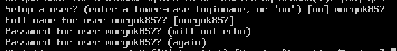

A continuación, debemos configurar la zona horaria del equipo. Por defecto nos muestra la que el instalador intento deducir. En caso de quere corregirlo debemos poner la zona que nos corresponda.

En nuestro caso America/Argentina/Buenos_Aires


Ahora nos pregunta sobre que disco queremos instalar el sistema. Si tenemos claro cúal es el disco correcto podemos pulsar "?" y "Enter" para ver los detalles.

En nuestro caso es el disco "sd0" por lo tanto escribimos "sd0" y damos "Enter"

Al ser un disco limpio nos pregunta si lo queremos como MBR o GPT. Seleccionamos GPT y damos "Enter" para avanzar.

Nos presenta un esquema de particiones que armó automáticamente en base a los recursos que detecto. Vamos a aceptarlo con cariño y oprimimos "a" + "Enter"

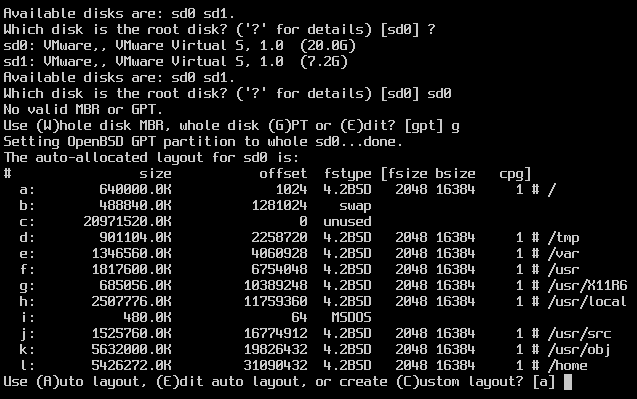

Luego de aplicar el particionado nos pregunta si queremos iniciar otro disco. Como no queremos configurar más discos oprimimos "Enter".

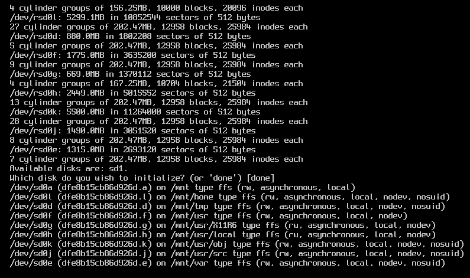

El instalador nos pregunta de dónde debe sacar los sets de instalación. Nos ofrece 3 opciones "cd0", "disk" o "http". Dependiendo del medio de instalación que utilicemos y si contamos con acceso a internet o no es la opción que debemos elegir.

Como estamos instalando desde un pendrive y en el tenemos todos los sets ahí vamos a ingresar "disk" + "Enter"

Cuando nos pregunte si está montado le decimos que "no" y lo confirmamos con "Enter"

Nos muestra las opciones disponibles y nos pide que elijamos la que corresponda.

En nuestro caso nos muestra 2 discos el "sd0" y el "sd1". Como ya le indicamos que queremos instalar el sistema en el disco sd0, el sd1 corresponde a nuestro pendrive. El indicamos que tome el "sd1" y lo confirmamos con "Enter".

Ahora nos pregunta por la partición que queremos montar. Seleccionamos "a" y lo confirmamos con "Enter".

Le indicamos que use la ruta por defecto para los stets con "Enter" y nos mostrará los sets de disponibles.

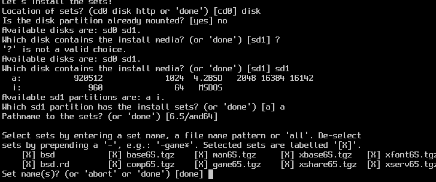

Nos interesa instalar todos los sets menos el de juegos, por lo tanto, procedemos a sacarlo escribiendo "-game*" y lo confirmamos con "Enter".

Luego volvemos a oprimir "Enter", ya que no queremos configurar otro medio para instalar otros sets.

Cuando nos pregunte si queremos instalar los datos por más que no los pueda validar le decimos "yes" y lo confirmamos con "Enter".

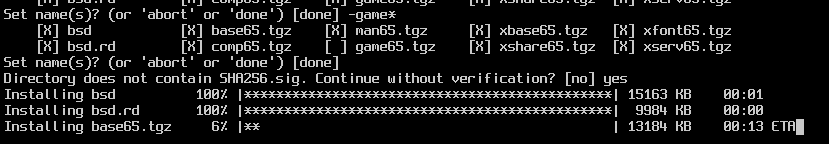

A continuación, le indicamos que no contamos con más sets para instalar oprimiendo "Enter".

Nos consulta si el horario que registra es correcto. Si la hora y fecha que nos muestra es correcta lo confirmamos con "yes" + "Enter".

Veremos que comienza a aplicar las configuraciones finales, Finalmente nos dice que está instalado el sistema.

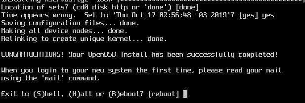

Ahora reiniciamos el equipo oprimiendo "Enter".

Luego del reinicio debemos ver la pantalla de login por defecto.

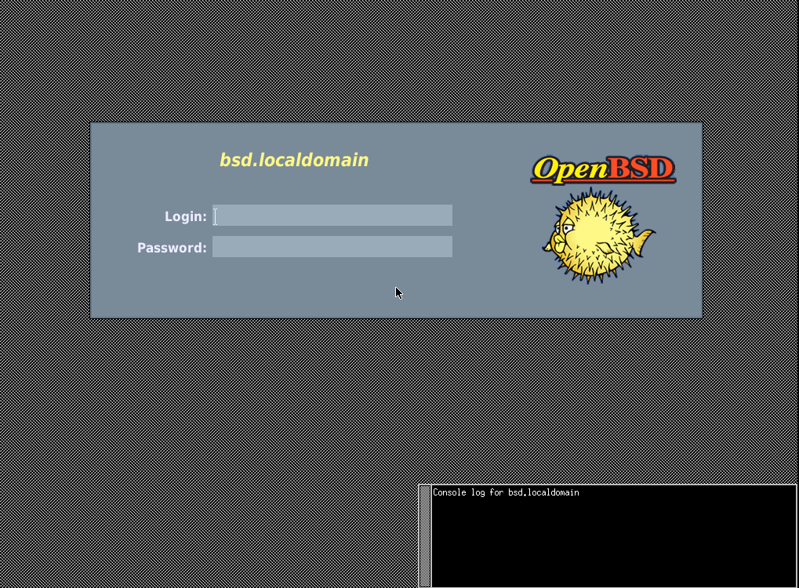

Si ves esta misma pantalla quiere decir que ya tenemos instalado OpenBSD en nuestra máquina virtual.

Solo resta ingresar las credenciales que configuramos durante la instalación y comenzar a trabajar !!!!