# Instalacion en VirtualBox con Pendrive Fisico

## Guia probada con VirtualBox 6.0 en Linux x64

Para poder usar un pendrive en vez del .iso para CD cambiamos algunas cosas:

- creamos un descriptor del disco para virtualbox (del pendrive)
- montamos el descriptor del pendrive como un disco SATA
- activamos UEFI

## Descargar imagen

Descargar installXX.fs [amd64] desde <https://www.openbsd.org/faq/faq4.html#Download>

Que en la version actual 6.5 seria <https://cdn.openbsd.org/pub/OpenBSD/6.5/amd64/install65.fs>

<div style="page-break-after: always;"></div>

## Determinar el dispositivo asociado al pendrive y desmontarlo

Para esta guia asumimos que es ```/dev/sdb```, para casos reales, ver este [link](https://askubuntu.com/questions/909346/how-to-tell-which-device-the-usb-drive-is-assigned-as)

```bash
sudo umount /dev/sdb
```

## Escribir la imagen en el pendrive

```bash
sudo dd bs=4M if=path/to/install65.fs of=/dev/sdb conv=fdatasync  status=progress
```

## Crear disco virtual (.vmdk) para VirtualBox

Es un wraper del Pendrive enchufado en el USB
Mas info en <https://www.virtualbox.org/manual/ch09.html>

- Notar que es necesario usar sudo porque se va a acceder al dispositivo fisico directamente
- apuntar al disco completo (ej: /dev/sdb - asi, sin numero de particion)
- reemplazar /dev/sdb por el device que corresponda

```bash
sudo vboxmanage internalcommands createrawvmdk \
-filename ~/install65.fs.vmdk \
-rawdisk /dev/sdb
```
<div style="page-break-after: always;"></div>

## Crear Maquina Virtual

#### Importante: ejecutar VirtualBox con sudo o no va a poder acceder al Pendrive fisico

```bash
sudo virtualbox
```

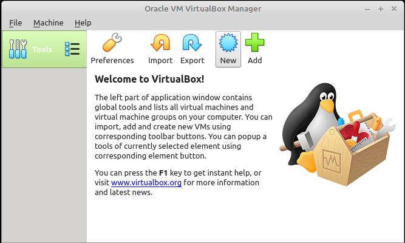

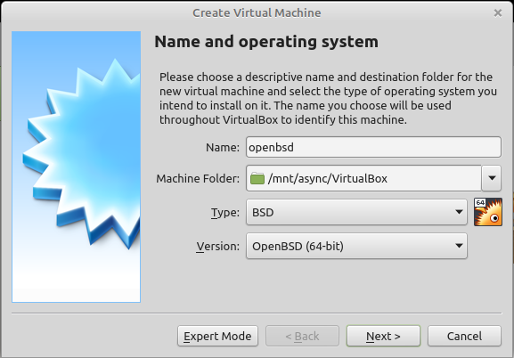

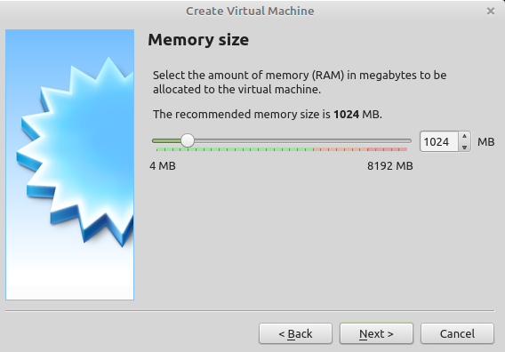

<div style="page-break-after: always;"></div>

## Crearle un disco

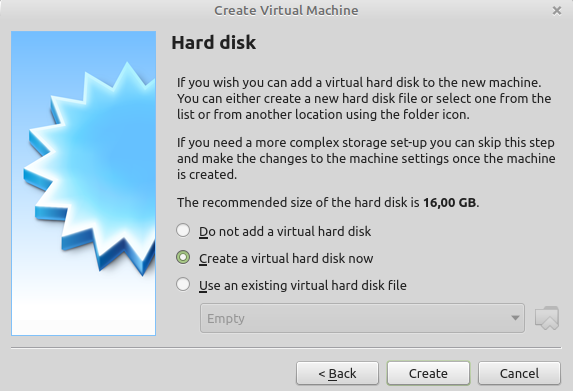

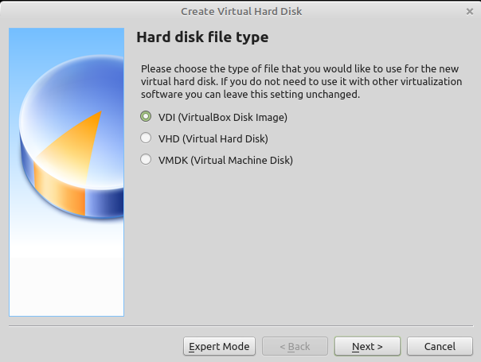

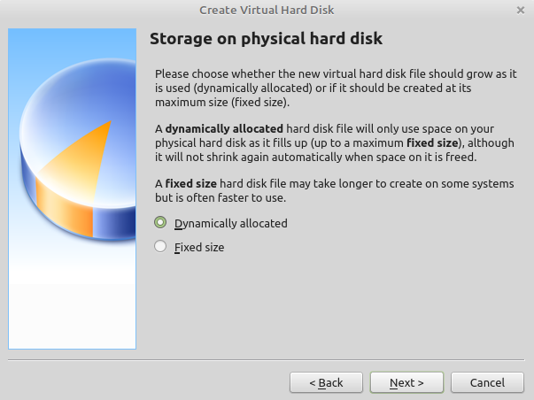

<div style="page-break-after: always;"></div>

## Recordar el tamaño para identificarlo luego

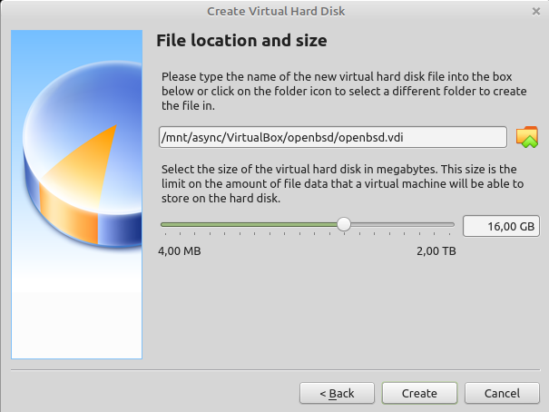

<div style="page-break-after: always;"></div>

## Resumen de la Maquina

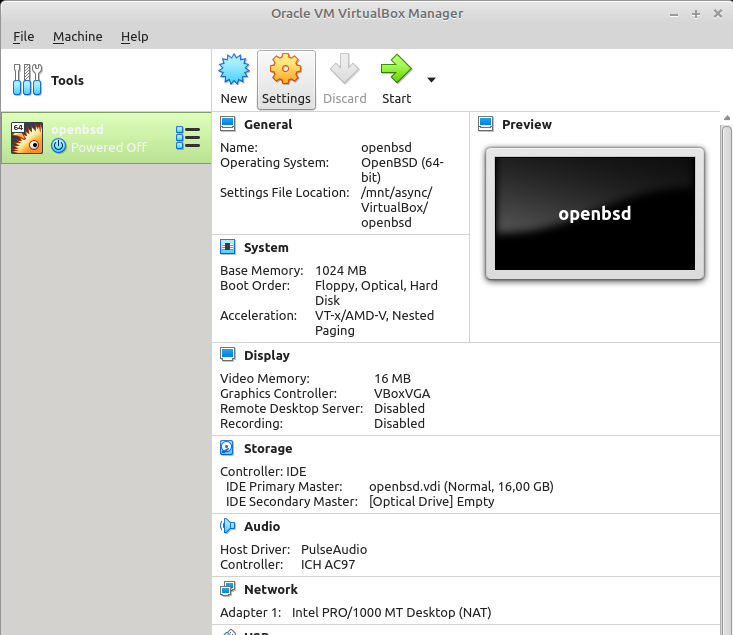

## Ahora hacemos algunas modificaciones

### Activar EFI en SYSTEM, MOTHERBOARS

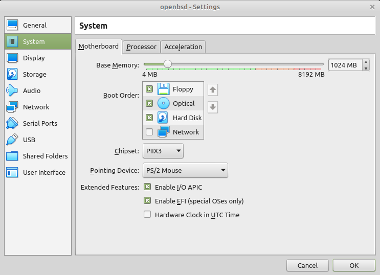

<div style="page-break-after: always;"></div>

## Cambiar la memoria de video a 4 MB

### para mitigar un inconveniente con la resolucion 

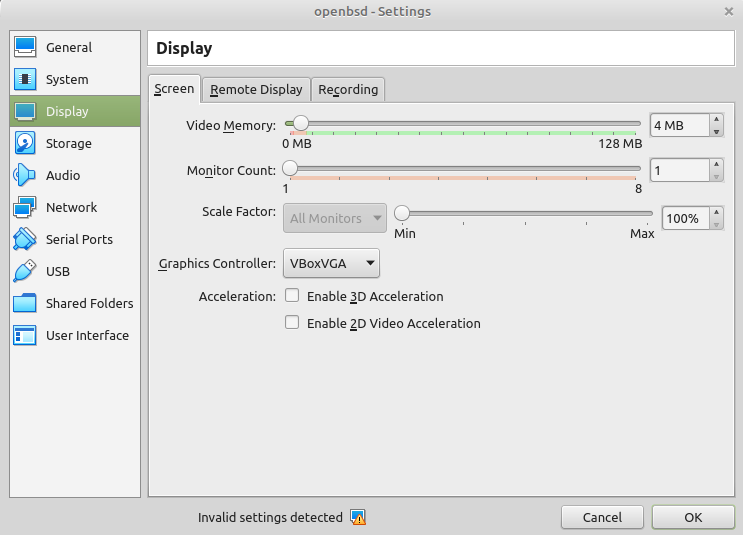

<div style="page-break-after: always;"></div>

## Agregar el disco de instalacion como un disco SATA en un controlador SATA

### Agregar el controlador SATA


<div style="page-break-after: always;"></div>

## Agregar el DISCO SATA

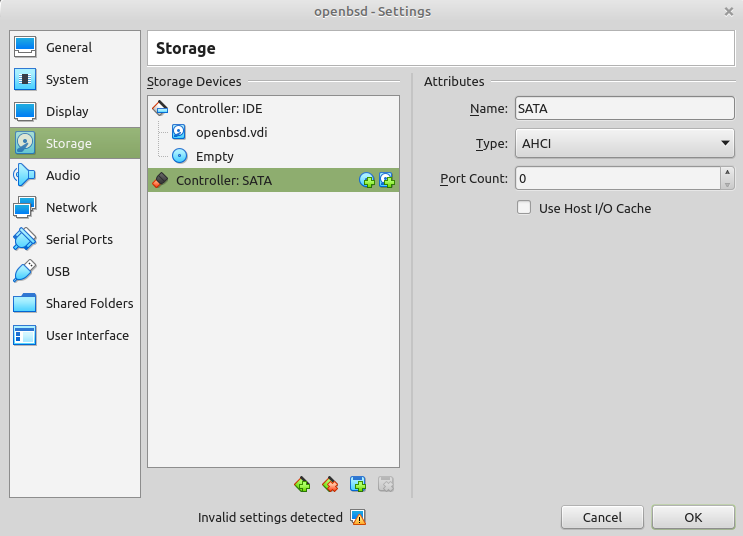

<div style="page-break-after: always;"></div>

## Elejir el boton "un disco existente"

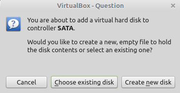

<div style="page-break-after: always;"></div>

## Nos muestra los discos registrados en VirtualBox, presionar el boton "Add"

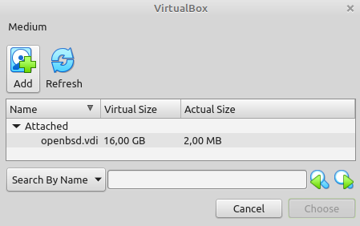

<div style="page-break-after: always;"></div>

## Y buscar el descriptor .vmdk que  generamos al principio

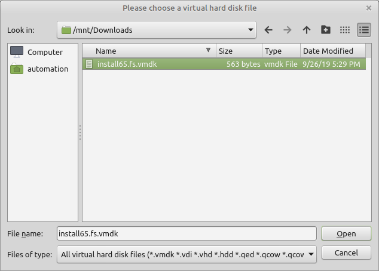

<div style="page-break-after: always;"></div>

## Ahora aparece registrado, selecionarlo

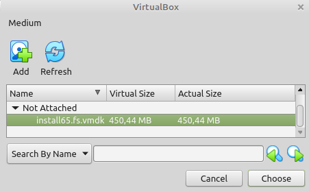

<div style="page-break-after: always;"></div>

## Asi queda colgando del controlador SATA

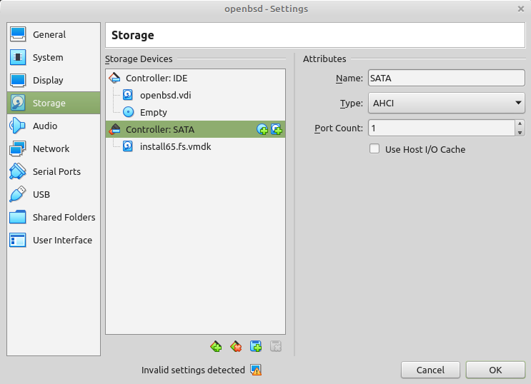

<div style="page-break-after: always;"></div>

## Finalmente aparece en el resumen de la maquina

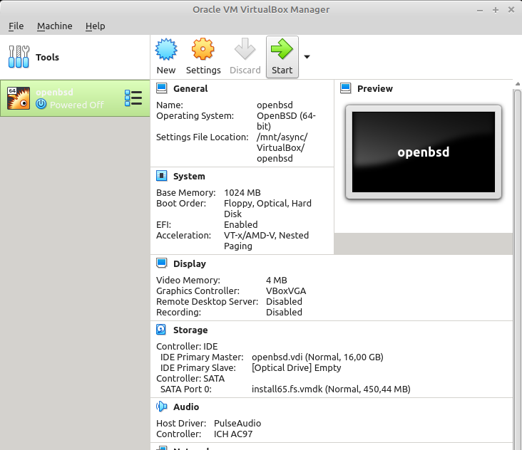
